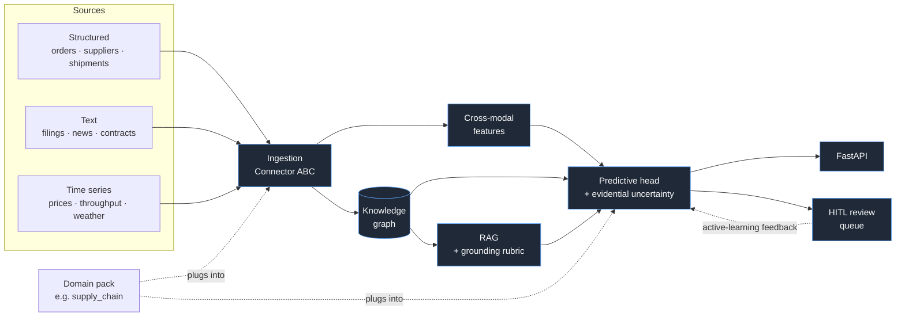

<!-- SPDX-License-Identifier: Apache-2.0 -->
<div align="center">

# Argus

**Multimodal, explainable, uncertainty-aware risk intelligence for high-stakes decisions.**

[](LICENSE)
[](pyproject.toml)
[](#)
[](#roadmap)

</div>

---

## Why Argus exists

Operational risk teams in supply chain, financial services, healthcare, and energy live inside the same painful workflow:
a tabular forecast says one thing, a Slack thread cites a news article that says another, an analyst rebuilds context
from three dashboards, and a decision gets made with no audit trail and no calibrated uncertainty. The next time it goes
wrong, nobody can reconstruct *why* the model was confident.

The state of the art in production ML doesn't fix this. Tabular models ignore the text. LLM wrappers hallucinate citations.
"Explainable AI" usually means a SHAP plot bolted onto a black-box prediction. None of these are honest about what the
model doesn't know.

**Argus is built around three claims:**

1. **Uncertainty is a first-class output.** Every prediction carries a calibrated confidence band derived from an
   evidential head — not a softmax probability dressed up as one.
2. **Every prediction is grounded.** The model's reasoning is paired with a retrieval trace, a knowledge-graph subgraph,
   and a grounding rubric that flags claims unsupported by retrieved evidence.
3. **Humans are in the loop by design.** A review queue, structured disagreements, and an active-learning feedback path
   are core platform components — not a feature flag on a finished system.

---

## What Argus is, technically

Argus is a Python platform with a **domain-agnostic core** and **pluggable domain packs**.

- **`argus.platform_core`** — ingestion connectors for structured / text / time-series data, cross-modal feature fusion,
  a knowledge-graph layer (Neo4j with a NetworkX fallback for local dev), predictive heads with evidential uncertainty,
  retrieval-augmented generation with a grounding rubric, and a human-in-the-loop review surface. Exposed via FastAPI.
- **`argus.domain_packs.*`** — verticals built on the core. The first reference pack is **supply chain disruption
  forecasting**, fusing DataCo orders/shipments, GDELT global event signals, and SEC EDGAR supplier filings.

Every external dependency — LLM provider, KG backend, cloud target — sits behind an interface so it can be swapped.
Configs live in YAML. There are no notebooks on `main`.

### Architecture at a glance



A deeper layering contract and the rationale for the plugin boundaries live in [`docs/architecture.md`](docs/architecture.md).
Responsible-AI commitments (intended use, limitations, bias considerations, data governance) live in
[`docs/responsible_ai.md`](docs/responsible_ai.md).

---

## Quickstart

```bash
# 1. Clone
git clone https://github.com/argus-ai/platform.git argus && cd argus

# 2. Install (Python 3.11 or 3.12)
python -m venv .venv
source .venv/bin/activate          # Windows: .\.venv\Scripts\activate
pip install -e ".[dev,supply-chain]"

# 3. Sanity check
argus version
pytest

# 4. Local stack — FastAPI + Neo4j + Streamlit reviewer (placeholders in Phase 1)
docker compose up
```

To fetch the supply-chain reference datasets (DataCo via Kaggle, GDELT subset, SEC EDGAR sample):

```bash
# Requires ~/.kaggle/kaggle.json for the DataCo source
python scripts/download_data.py --source all
```

---

## Design principles

These are guardrails, not aspirations. Every PR is reviewed against them.

| | |
|---|---|
| **Interfaces over implementations** | LLM provider, KG backend, and cloud target are pluggable. Vendor lock-in is a code smell. |
| **Config, not constants** | All paths, models, prompts, and thresholds live in YAML. Hardcoded `"/data/foo.csv"` is a review-blocker. |
| **Uncertainty is non-optional** | Every model output carries a calibrated confidence band. A point prediction is incomplete. |
| **Every prediction is grounded** | Attribution + retrieved evidence accompany every output. RAG output is checked against a grounding rubric. |
| **HITL is a design pillar** | Review queue, disagreement capture, and active-learning feedback ship with the platform, not after it. |
| **No notebooks on main** | Everything is testable Python. Exploratory work lives in branches and is converted to modules before merge. |
| **Typed, tested, lintable** | mypy strict, ruff, pytest with 80%+ coverage target, bandit security scan. CI fails the PR, not the engineer. |

---

## Roadmap

| Phase | Scope | Status |
|---|---|---|
| **1. Scaffold + ingestion + docs + CI** | Repo skeleton, packaging, ingestion ABCs + connectors, supply-chain schemas + loaders, source downloaders, CI, Docker, docs | **in progress** |
| **2. Knowledge graph engine** | Neo4j construction from supply-chain entities, cascading-risk queries, NetworkX fallback, `KGBackend` Protocol | next |
| **3. Predictive head with evidential uncertainty** | Baseline tabular models (LightGBM, XGBoost), evidential heads, cross-modal fusion, `UncertainPrediction` schema | |
| **4. RAG + grounding rubric + fabrication check** | `LLMProvider` (OpenAI + local), retriever over KG + vector store, grounding rubric, fabrication check | |
| **5. HITL dashboard + active learning loop** | Streamlit reviewer dashboard, `ReviewSink` Protocol, disagreement schema, active-learning feedback into Phase-3 models, evaluation harness | |
| **6. Terraform multi-cloud deployment** | Terraform for GCP + AWS, multi-arch image push, K8s manifests, OpenTelemetry traces, Prometheus + Grafana | |

Each phase ends with a tagged release, a refreshed `docs/architecture.md`, and runnable acceptance criteria.

---

## Repository layout

```
argus/                          # Python package (decision A: import name = argus)
├── platform_core/              # domain-agnostic primitives
│   ├── ingestion/              # Connector ABC + structured/text/time-series connectors
│   ├── features/               # cross-modal encoders and fusion layers
│   ├── kg/                     # knowledge-graph construction + queries
│   ├── models/                 # predictive heads with evidential uncertainty (Phase 3)
│   ├── rag/                    # retrieval, grounding rubric, fabrication check
│   ├── hitl/                   # review queue and active-learning feedback
│   └── api/                    # FastAPI service layer
└── domain_packs/
    └── supply_chain/           # decision B: installable extra `argus-risk[supply-chain]`
        ├── data/               # schemas (Order, Supplier, Shipment, EventSignal) + loaders
        ├── prompts/            # domain-tuned LLM prompts
        ├── models/             # domain-tuned heads
        └── evaluation/         # domain benchmarks

frontend/                       # Streamlit reviewer dashboard
infra/{docker,terraform,k8s}/   # local + multi-cloud infrastructure
ci/.github/workflows/           # CI pipelines
docs/                           # architecture.md, responsible_ai.md, CONTRIBUTING.md
tests/                          # pytest suite + tests/fixtures/ sample data
scripts/                        # download_data.py, build_fixtures.py
configs/                        # YAML configs (no hardcoded paths anywhere else)
```

---

## Contributing

See [`CONTRIBUTING.md`](CONTRIBUTING.md) for the contribution workflow, commit conventions, and code-review checklist.
Discussions and issues are welcome on GitHub.

## License

Apache 2.0 — see [`LICENSE`](LICENSE).
